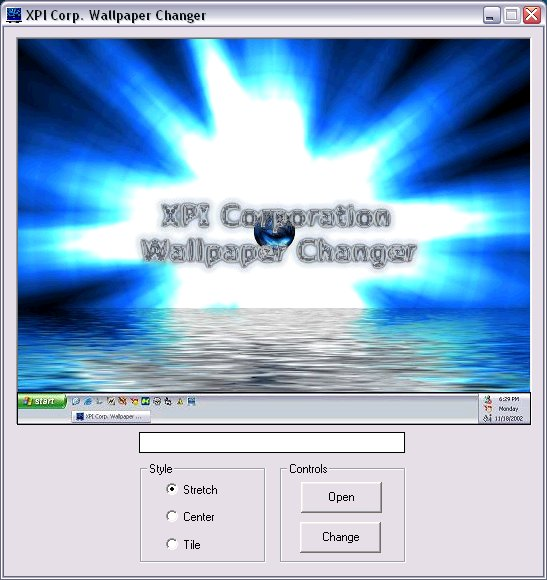



## XPI Corp\. Wallpaper Changer

### Description

This program easily lets you change your wallpaper. It even gives you a preview of what you're desktop will look like. It lets you choose between centering, tiling, and stretching. Also, you can drag and drop your image file onto the exe or shortcut to automatically change it.
 
### More Info
 
An image file.

Changed Wallpaper.

             |
---                |---
**Submitted On**   |2002-12-01 17:07:34
**By**             |[PxHxAxNxTxOxM](https://github.com/Planet-Source-Code/PSCIndex/blob/master/ByAuthor/pxhxaxnxtxoxm.md)
**Level**          |Advanced
**User Rating**    |5.0 (10 globes from 2 users)
**Compatibility**  |VB 4\.0 \(32\-bit\), VB 5\.0, VB 6\.0
**Category**       |[Complete Applications](https://github.com/Planet-Source-Code/PSCIndex/blob/master/ByCategory/complete-applications__1-27.md)
**World**          |[Visual Basic](https://github.com/Planet-Source-Code/PSCIndex/blob/master/ByWorld/visual-basic.md)
**Archive File**   |[XPI\_Corp\_\_1506271212002\.zip](https://github.com/Planet-Source-Code/pxhxaxnxtxoxm-xpi-corp-wallpaper-changer__1-41205/archive/master.zip)

### API Declarations

SystemParametersInfo, GetWindowsDirectory, RegCloseKey, RegCreateKey, SetSysColors, and GetSysColors.

